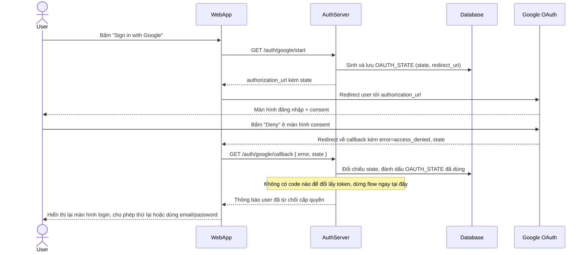

# Enhance sequence — Google login deny

Đây là **enhance**, flow hoàn toàn mới so với base — xử lý trường hợp user bấm "Deny" ở màn hình consent của Google, đúng yêu cầu cuối trong đề bài. Chọn vẽ riêng flow này vì đây là 1 nhánh kết thúc sớm, không đi tới bước đổi code lấy token, cần xử lý gọn để không văng lỗi khó hiểu cho user.

