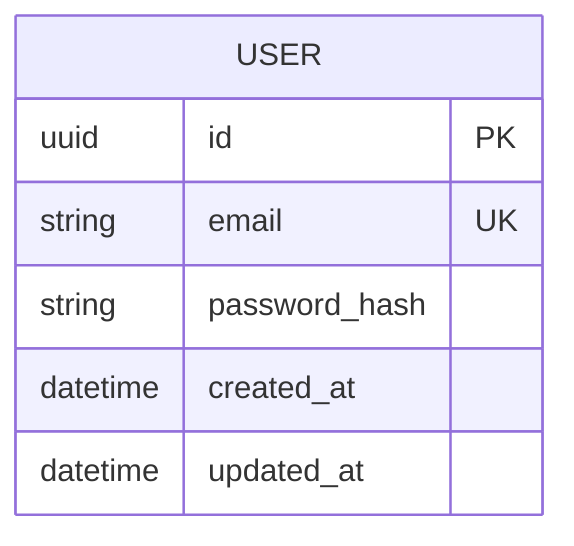

# ERD — Baseline User Schema

**Lớp: black-box** — **Nhóm: Hiện trạng**. Diagram này mô hình hoá dữ liệu user tối thiểu để hỗ trợ đăng nhập email/password trước khi có Google OAuth. ERD luôn bắt buộc vẽ; ở đây chỉ mô hình phần dữ liệu liên quan trực tiếp tới xác thực (đề bài không mô tả chi tiết các bảng khác của task dashboard như board/task).

`password_hash` là bắt buộc (`NOT NULL`) ở baseline vì đây là cách xác thực duy nhất — mọi user đều được tạo qua flow đăng ký email/password.
