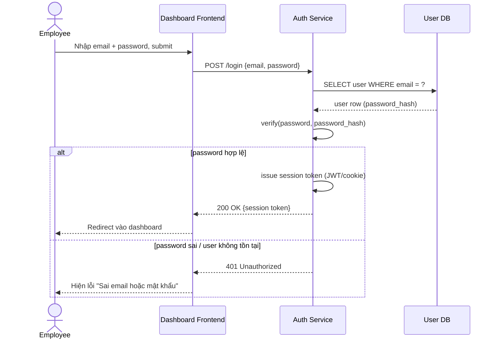

# Sequence — Login with Email/Password

**Lớp: black-box** — **Nhóm: Hiện trạng**. Diagram này thể hiện thứ tự message của action "Login with email/password" đã liệt kê ở Use case baseline — mỗi action trong Use case ứng với đúng 1 sequence, và đây là action duy nhất của nhóm Hiện trạng.

