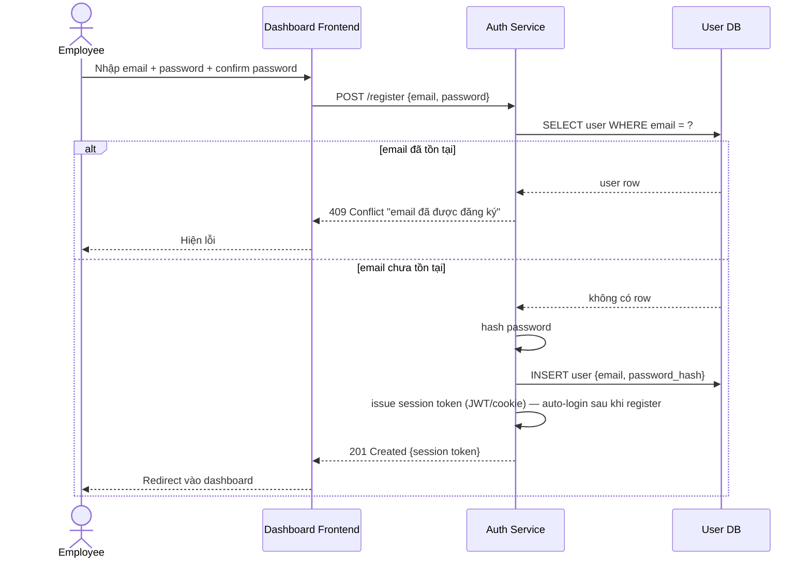

# Sequence — Register (Email/Password)

**Lớp: black-box** — **Nhóm: Hiện trạng**. Diagram này thể hiện action "Register (email/password)" đã bổ sung vào Use case baseline (`1-usecase-baseline-auth.md`) — tiền đề bắt buộc để có account cho action Login xác thực vào.

**Ghi chú thiết kế:** Register tự động đăng nhập luôn sau khi tạo account thành công (dùng chung `Session Issuer` với Login, xem `baseline-white-box/1-component-auth-service.md`) — tránh bắt user phải login lại lần nữa ngay sau khi vừa đăng ký.
