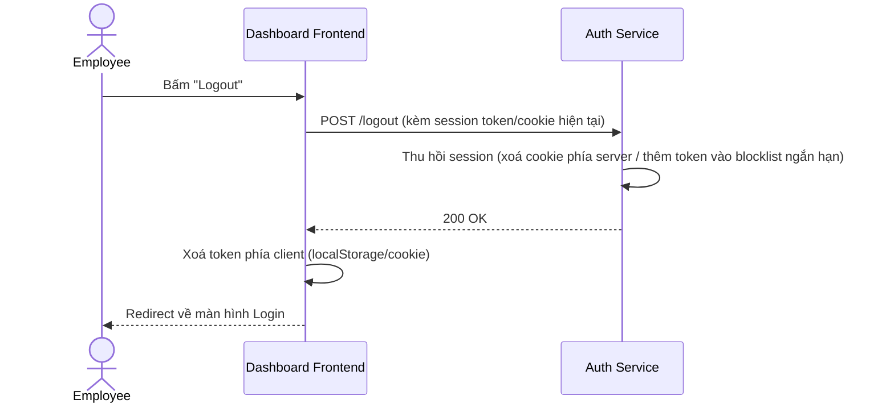

# Sequence — Logout

**Lớp: black-box** — **Nhóm: Hiện trạng**. Diagram này thể hiện action "Logout" đã bổ sung vào Use case baseline (`1-usecase-baseline-auth.md`) — action đối xứng bắt buộc với Login để kết thúc session, hoàn thiện vòng đời auth trước khi so sánh với nhóm Thay đổi.

**Ghi chú:** Vì baseline dùng session token dạng JWT/cookie tự phát (không lưu bảng session riêng), logout không cần entity mới trong ERD — chỉ cần vô hiệu hoá token hiện tại (hoặc đơn giản là để cookie hết hạn/bị xoá phía client nếu chấp nhận JWT còn hạn vẫn valid tới khi tự expire).
