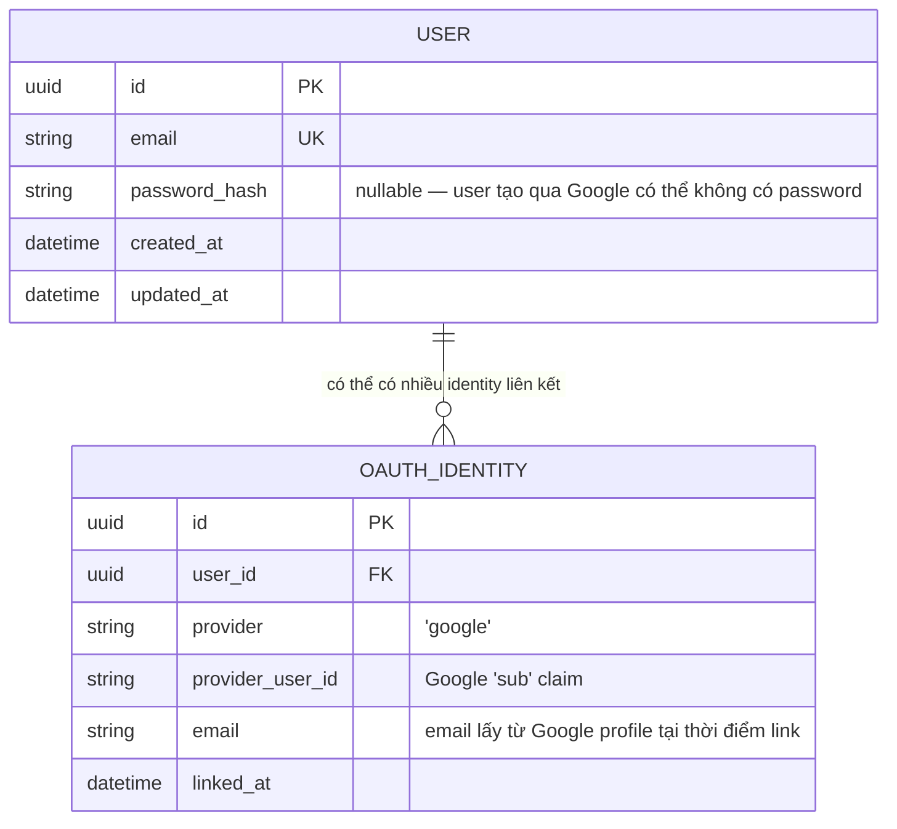

# ERD — Add Google Identity

**Lớp: black-box** — **Nhóm: Thay đổi**. Diagram này thể hiện thay đổi dữ liệu cần thiết để hỗ trợ Google OAuth: thêm bảng `OAUTH_IDENTITY` để lưu account linking, và nới `password_hash` thành optional vì user tạo mới qua Google có thể không có password. So sánh trực tiếp với ERD baseline ở `baseline-black-box/2-erd-user-schema.md` để thấy đúng phần dữ liệu bị ảnh hưởng.

**Thay đổi so với baseline:**
- `USER.password_hash` chuyển từ bắt buộc sang nullable — hỗ trợ user tạo mới hoàn toàn qua Google, chưa từng đặt password.
- Bảng `OAUTH_IDENTITY` mới, `provider_user_id` (Google `sub`) là khoá định danh ổn định để account-linking không phụ thuộc vào email có thể đổi.
- Ràng buộc nghiệp vụ (không thể hiện được trực tiếp trên ERD): 1 lần login Google đầu tiên với email đã tồn tại trong `USER` → chỉ tạo `OAUTH_IDENTITY` trỏ tới `USER` cũ, không tạo `USER` mới (đúng yêu cầu "map với account cũ nếu email đã tồn tại").
