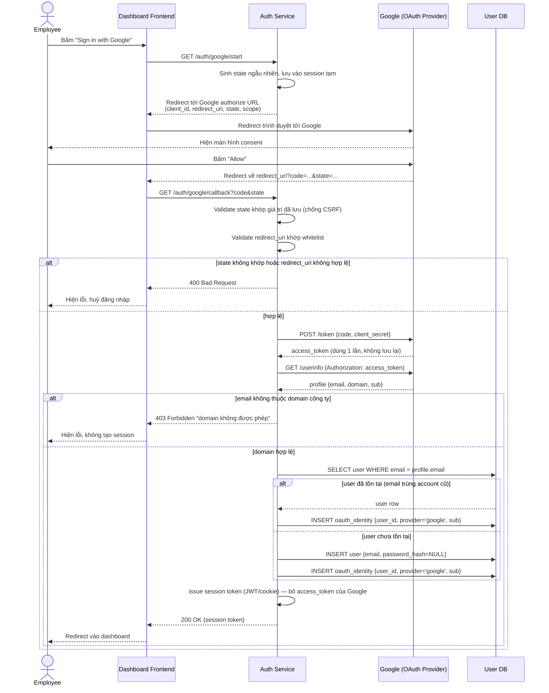

# Sequence — Login with Google

**Lớp: black-box** — **Nhóm: Thay đổi**. Diagram này thể hiện action "Login with Google" đã liệt kê ở Use case thay đổi — full authorization code flow, gồm state CSRF check, redirect_uri whitelist, domain restriction, và account linking đúng như yêu cầu đề bài.

