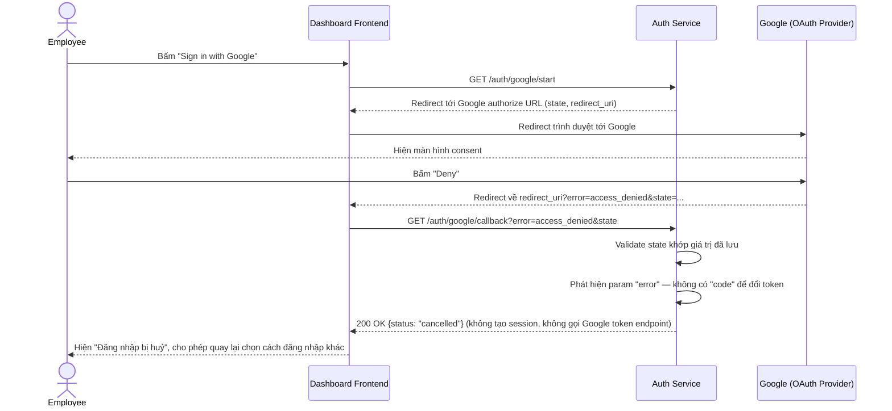

# Sequence — Deny Google Consent

**Lớp: black-box** — **Nhóm: Thay đổi**. Diagram này thể hiện action "Deny Google consent" đã liệt kê ở Use case thay đổi (`<<extend>>` của "Login with Google") — đúng yêu cầu đề bài "xử lý được case user bấm Deny ở màn hình consent của Google". Luồng callback ở đây khác hẳn happy path: không có `code`, có `error=access_denied`, nên không thể gộp chung vào sequence "Login with Google".

