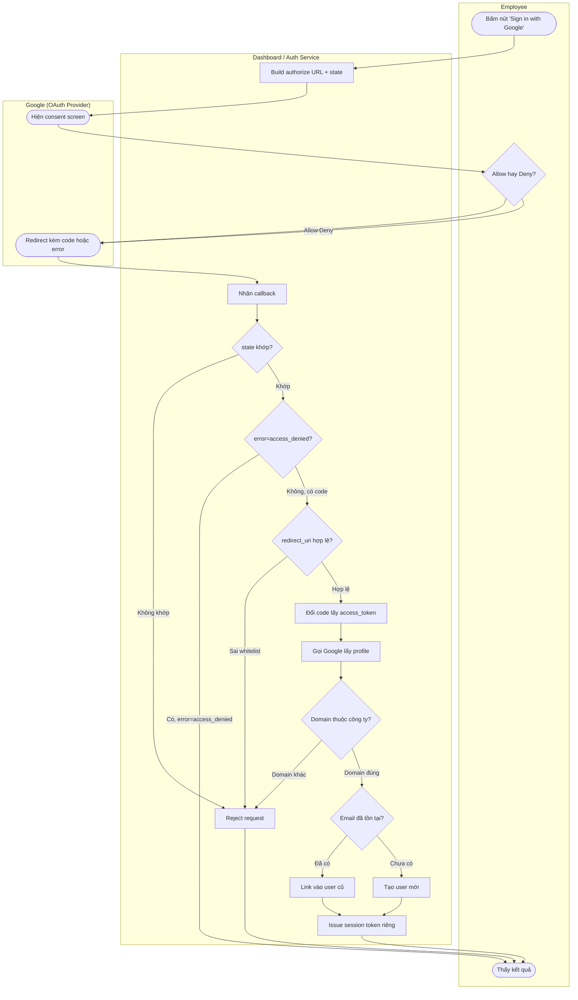

# Activity — Google OAuth Login Flow

**Lớp: black-box** — **Nhóm: Thay đổi**. Diagram này thể hiện toàn bộ quy trình nghiệp vụ của "Login with Google" dưới dạng các bước rẽ nhánh, gộp cả 2 use case (Login thành công và Deny consent) cùng các điều kiện phụ (CSRF state, redirect_uri whitelist, domain restriction, account linking) vào 1 bức tranh duy nhất. Tín hiệu chọn Activity thay vì Flowchart: quy trình có nhiều rẽ nhánh thật và có 3 actor tham gia qua lại (Employee, App, Google) — đúng bảng tín hiệu ở Bước 1 ("quy trình nghiệp vụ nhiều bước, nhiều actor duyệt qua lại").

**Ghi chú:** `access_token` của Google (bước B6) chỉ dùng để gọi B7 rồi bỏ, không lưu vào DB (`Session token` ở B12 là token do hệ thống tự phát, tách biệt hoàn toàn) — đúng yêu cầu đề bài.
