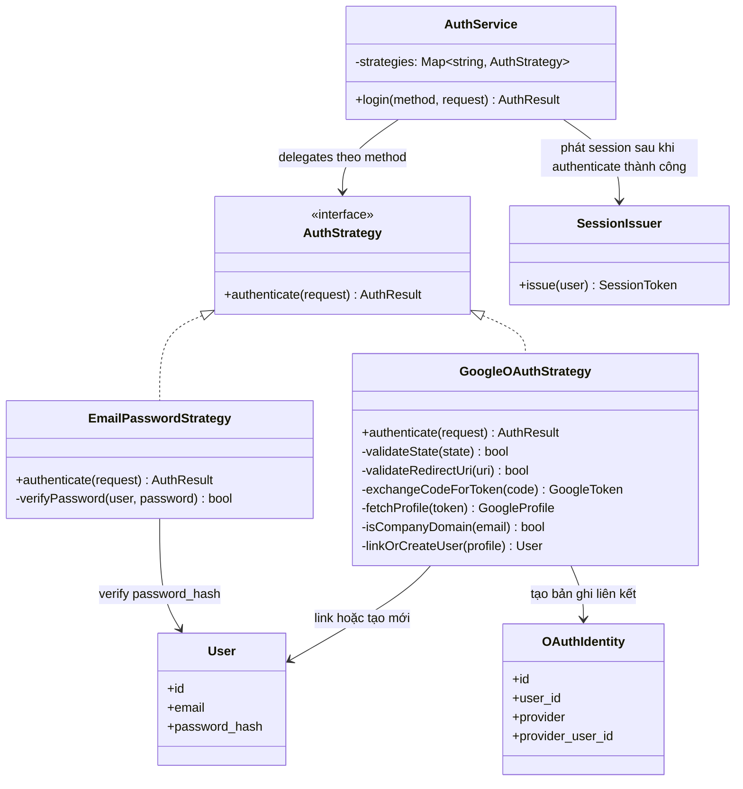

# Class — Auth Strategy (Email/Password vs Google OAuth)

**Lớp: white-box** — **Nhóm: Thay đổi**. Diagram này tự thiết kế breakdown OOP cho `AuthService`: khi có 2 cách đăng nhập cùng tồn tại song song (đề bài: "thay thế/song song với login truyền thống"), mỗi cách có logic xác thực khác hẳn nhau (so password hash vs. cả chuỗi OAuth code-exchange + domain check + account-linking) — Strategy pattern làm rõ ranh giới này và cho phép thêm provider OAuth khác sau này mà không sửa `AuthService`.

**Vì sao Strategy chứ không if/else:** `GoogleOAuthStrategy` có state riêng (CSRF `state`, redirect_uri whitelist) mà `EmailPasswordStrategy` không có — nhét chung vào 1 class sẽ lẫn lộn field/method không dùng chung; tách class cũng khiến `AuthService.login()` không phình to khi có thêm provider OAuth thứ 3 sau này.
