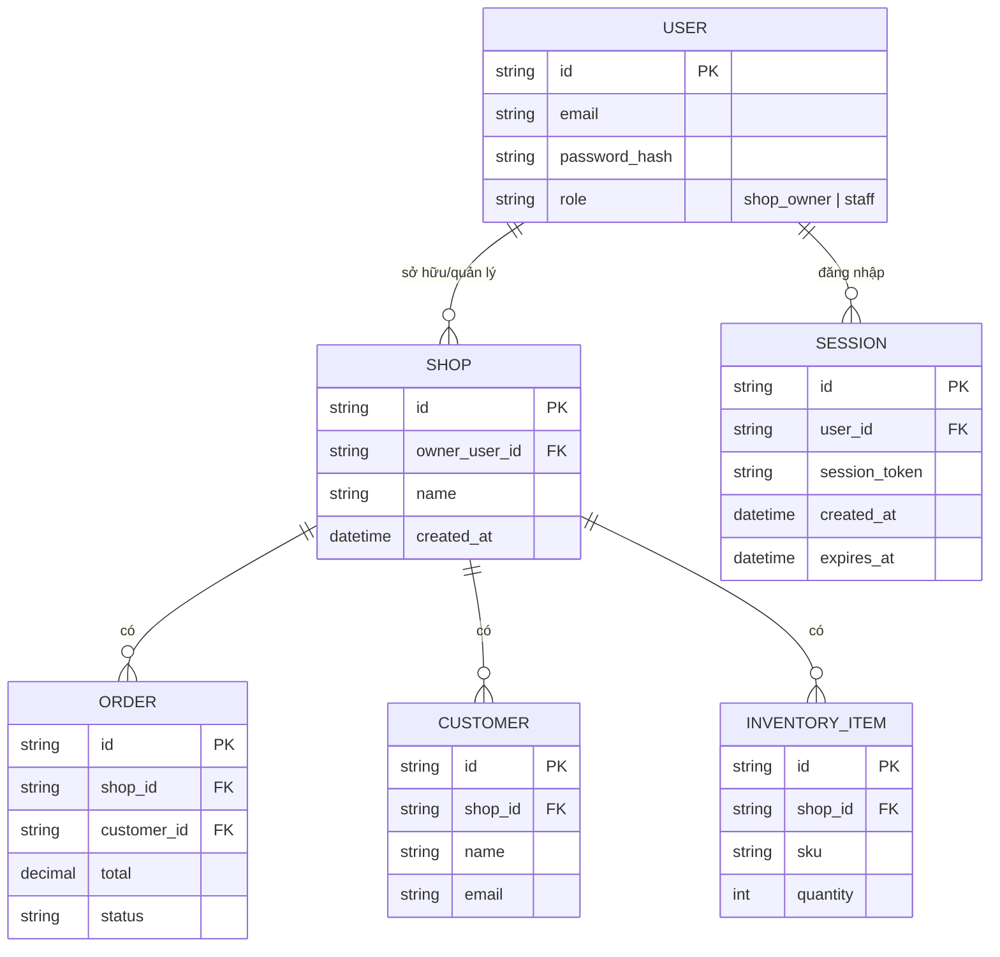

# Base ERD — Platform e-commerce trước khi có OAuth Provider cho app thứ ba

Đây là **base**: mô hình dữ liệu suy luận từ ngữ cảnh đề bài. Đề bài nói enhance sẽ cấp quyền truy cập API dữ liệu shop (đọc order, đọc customer, ghi inventory) cho app bên ngoài — để việc này có nghĩa, base phải đã có sẵn 1 platform e-commerce với Shop, User (chủ shop/nhân viên đăng nhập quản trị shop), và các resource cốt lõi Order/Customer/Inventory mà sau này sẽ bị scope hoá. Base **chưa có** khái niệm OAuth app bên thứ ba, client_id/client_secret, authorization/consent, access token có scope — toàn bộ truy cập dữ liệu hiện chỉ qua session đăng nhập trực tiếp của chủ shop.

