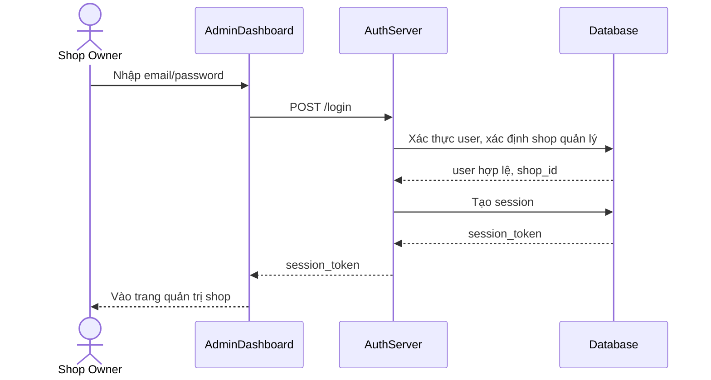

# Base sequence — Shop owner login

Đây là **base**, flow "Chủ shop đăng nhập vào trang quản trị" — tiền đề bắt buộc cho enhance, vì màn hình consent (nơi user quyết định approve quyền cho app thứ ba) chỉ có nghĩa khi user đã đăng nhập và xác định được đây là user nào, quản lý shop nào.

