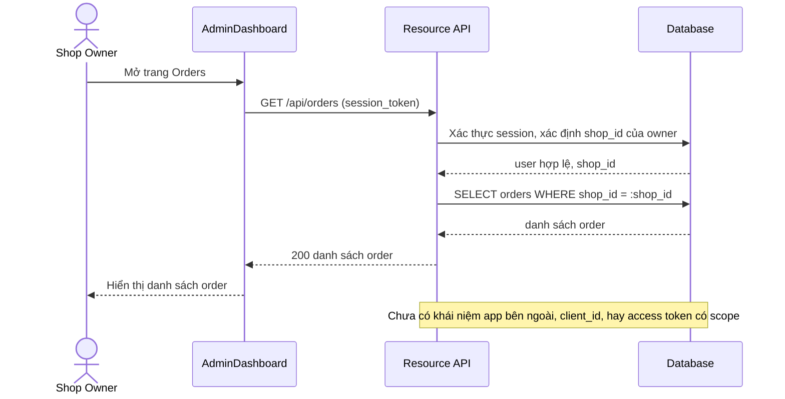

# Base sequence — View shop data

Đây là **base**, flow "Chủ shop xem dữ liệu order/customer/inventory qua trang quản trị" — chọn flow này để làm rõ mô hình truy cập dữ liệu hiện tại: chỉ qua session của chính chủ shop, chưa có khái niệm 1 bên thứ ba nào khác gọi vào cùng API này. Đây là baseline mà flow enhance "app thứ ba gọi API" (Bước 6) sẽ mở rộng thêm 1 đường truy cập hoàn toàn mới bên cạnh, chứ không thay thế flow này.

