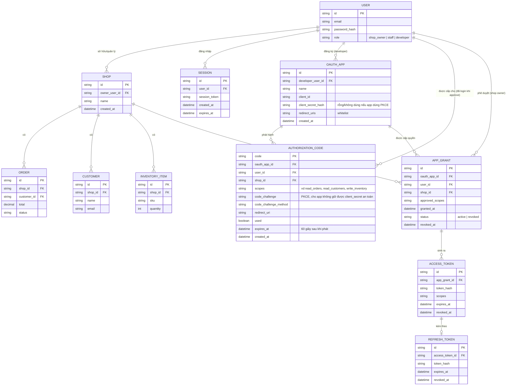

# Enhance ERD — Hệ thống đóng vai trò OAuth Authorization Server cho app thứ ba

Đây là ERD **sau khi** enhance được áp dụng lên base. `USER`, `SHOP`, `SESSION`, `ORDER`, `CUSTOMER`, `INVENTORY_ITEM` giữ nguyên. So với base, có 4 nhóm entity mới, ứng trực tiếp với 5 yêu cầu trong đề bài:

- `OAUTH_APP` (mới) — developer đăng ký qua Developer Portal, nhận `client_id`/`client_secret`, khai báo `redirect_uris` whitelist.
- `AUTHORIZATION_CODE` (mới) — code tạm phát ra sau khi user approve ở consent screen, chỉ dùng 1 lần (`used`), hết hạn 60 giây, mang theo `code_challenge` (PKCE) để validate ở bước đổi token.
- `APP_GRANT` (mới) — bản ghi user đã approve app nào, cho shop nào, với scope gì — là gốc để cascade revoke toàn bộ token liên quan khi user vào "App đã kết nối" để thu hồi quyền.
- `ACCESS_TOKEN` + `REFRESH_TOKEN` (mới) — access token mang theo `scopes` đã approve để resource server đối chiếu khi có request, refresh token đi kèm để cấp lại access token mới.

