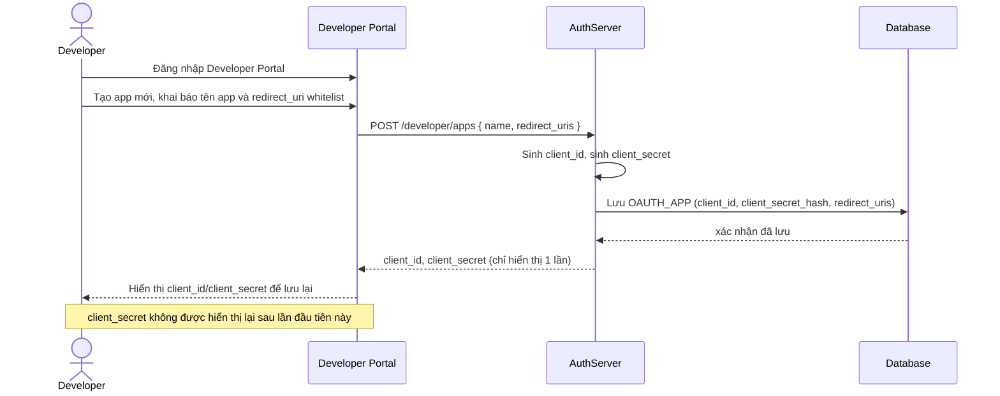

# Enhance sequence — Register OAuth app

Đây là **enhance**, flow hoàn toàn mới so với base — developer bên ngoài đăng ký app qua Developer Portal, nhận về `client_id`/`client_secret` và khai báo `redirect_uri` whitelist. Đây là bước tiên quyết để bất kỳ app nào có thể tham gia flow authorization ở các bước sau.

