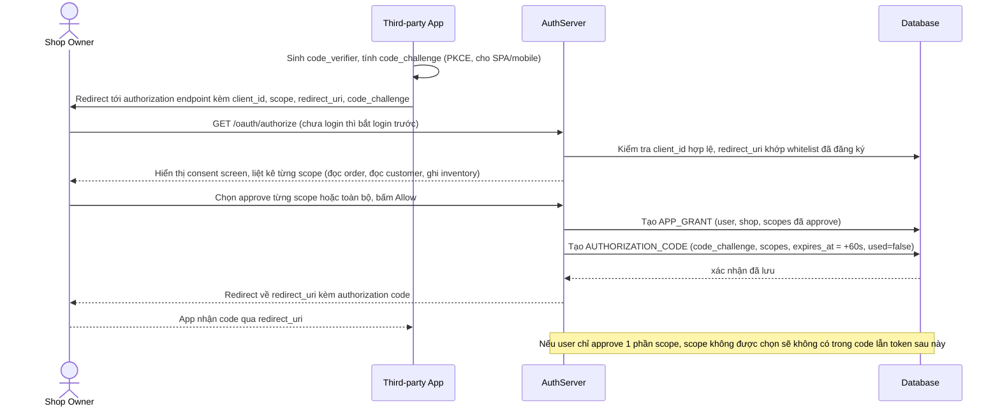

# Enhance sequence — Authorize consent

Đây là **enhance**, flow hoàn toàn mới so với base — app thứ ba redirect user tới authorization endpoint, hệ thống hiển thị consent screen liệt kê rõ scope app xin, cho user chọn approve từng phần hoặc toàn bộ, rồi phát authorization code chỉ dùng 1 lần trong 60 giây, kèm `code_challenge` theo PKCE cho app không giữ được client_secret an toàn.

