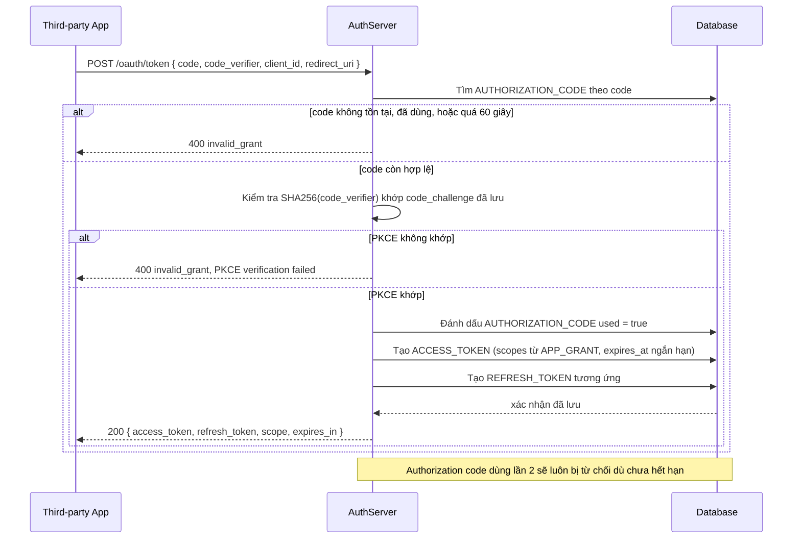

# Enhance sequence — Token exchange

Đây là **enhance**, flow hoàn toàn mới so với base — app đổi authorization code lấy access token/refresh token ở token endpoint. Flow này thể hiện rõ việc validate code chỉ dùng 1 lần, đã hết hạn thì từ chối, và validate PKCE `code_verifier` khớp với `code_challenge` đã lưu ở bước authorize.

