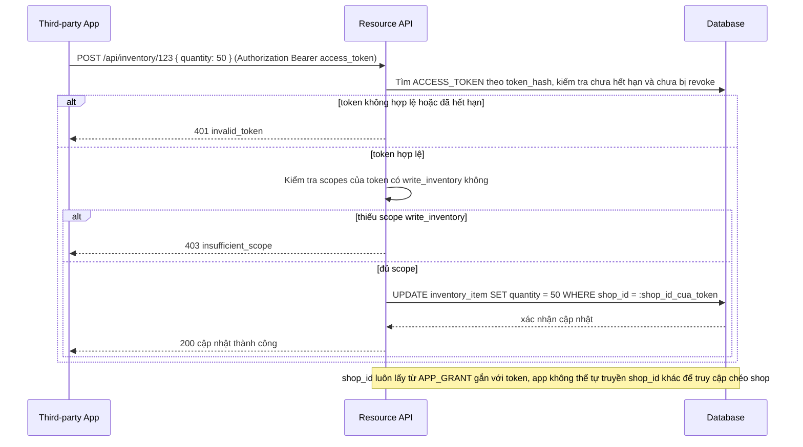

# Enhance sequence — API request scope check

Đây là **enhance**, flow hoàn toàn mới so với base — app thứ ba dùng access token gọi vào cùng Resource API mà trước đây chỉ chủ shop truy cập qua session (xem `3-base-view-shop-data-sqd.md`). Resource server giờ phải kiểm tra access token có đủ scope cần thiết cho từng endpoint, chặn request nếu thiếu scope, dù token vẫn còn hạn.

