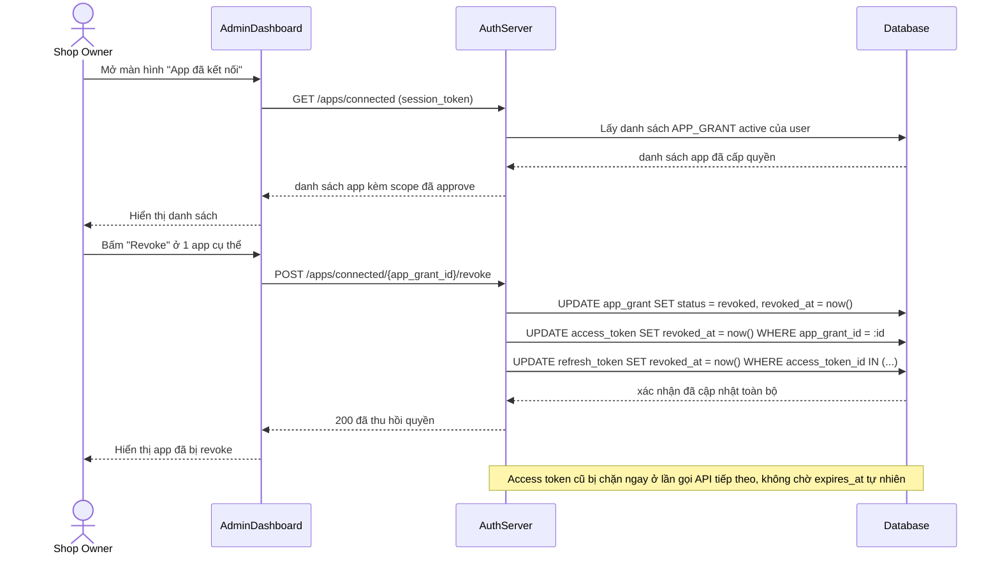

# Enhance sequence — Revoke app

Đây là **enhance**, flow hoàn toàn mới so với base — user vào màn hình "App đã kết nối" để thu hồi quyền của 1 app bất kỳ. Revoke phải làm mọi access token/refresh token liên quan tới `APP_GRANT` đó hết hiệu lực ngay lập tức, không chờ tự hết hạn.

