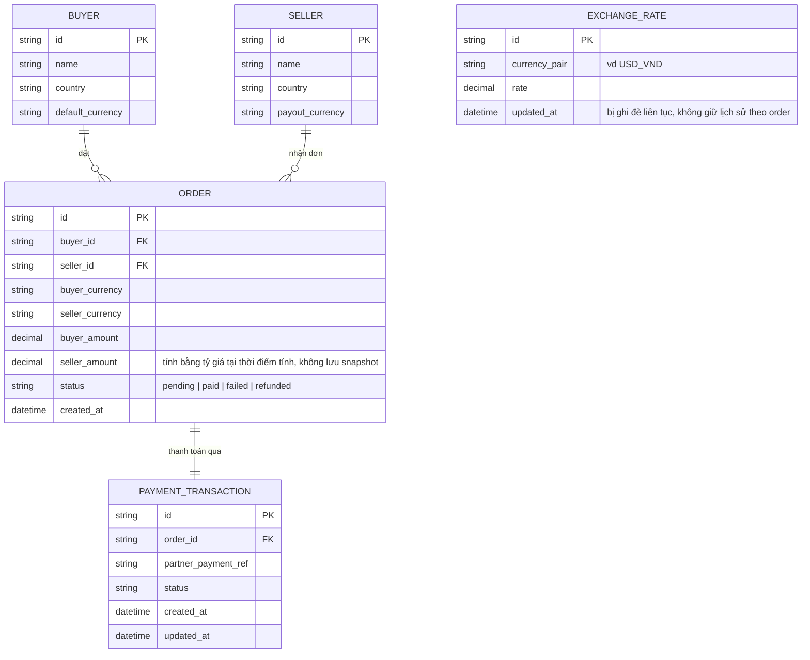

# Base ERD — Sàn xuyên biên giới trước khi khóa tỷ giá và đối soát chuẩn hóa

Đây là **base**: mô hình dữ liệu suy luận từ ngữ cảnh đề bài. Hệ thống đã là 1 sàn thương mại xuyên biên giới có buyer trả bằng tiền tệ nội địa, seller nhận theo tiền tệ của mình, thanh toán qua đối tác quốc tế có callback — nên base cần có Buyer, Seller, Order (mang cả 2 loại tiền tệ), giao dịch thanh toán, và 1 bảng tỷ giá. Điểm mấu chốt của base: `EXCHANGE_RATE` chỉ là **tỷ giá hiện tại (live)**, bị ghi đè liên tục, không có cơ chế snapshot/khóa tỷ giá theo từng đơn hàng — đây chính là lỗ hổng mà enhance phải vá. Base cũng **chưa có** entity nào phục vụ refund theo tỷ giá đã khóa hay đối soát tách riêng theo từng loại tiền tệ.

