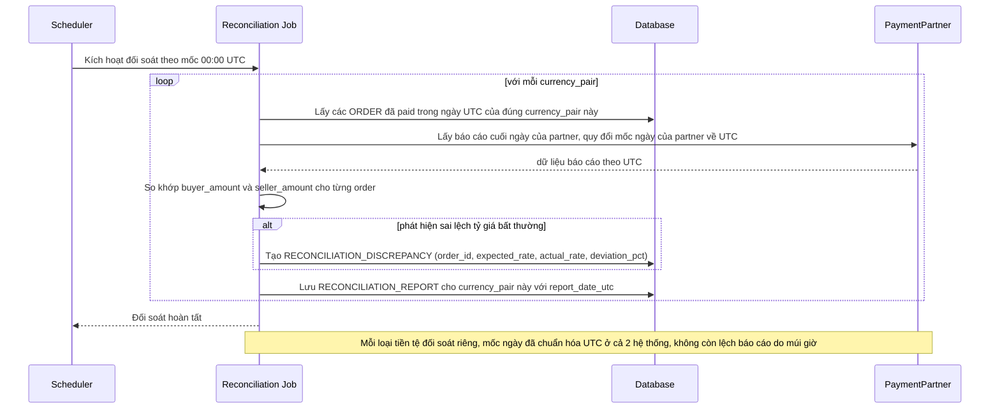

# Enhance sequence — Daily reconciliation

Đây là **enhance**, flow "Đối soát cuối ngày với đối tác thanh toán". So với base, mốc "cuối ngày" nay được chuẩn hóa về UTC ở cả 2 phía trước khi so khớp, và đối soát chạy riêng theo từng `currency_pair` thay vì gộp chung — so khớp cả số tiền gốc (buyer trả) lẫn số tiền quy đổi (seller nhận), phát hiện và gắn cờ các order có sai lệch tỷ giá bất thường để điều tra riêng.

