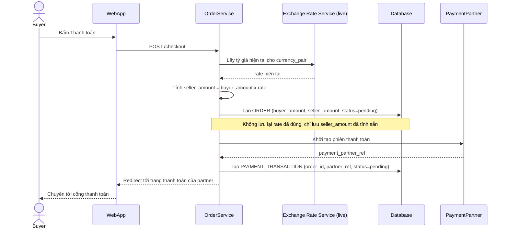

# Base sequence — Checkout payment

Đây là **base**, flow "Buyer bấm thanh toán" — chọn flow này vì đây chính là nơi tỷ giá lẽ ra phải được khóa lại nhưng ở base chưa làm vậy. Hệ thống chỉ tra tỷ giá hiện tại (live) để tính số tiền seller nhận tại thời điểm này, không lưu lại tỷ giá đã dùng gắn với order.

