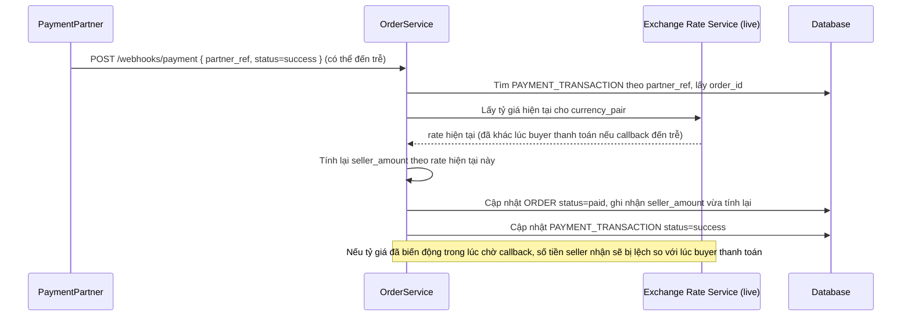

# Base sequence — Payment callback

Đây là **base**, flow "Nhận callback kết quả thanh toán từ đối tác" — chọn flow này vì đây chính là nơi bug xảy ra: callback có thể đến trễ (hàng chục giờ), nhưng hệ thống base lại tra tỷ giá hiện tại **lần nữa** tại thời điểm callback đến để tính số tiền cuối cùng, thay vì dùng đúng tỷ giá lúc buyer thanh toán.

