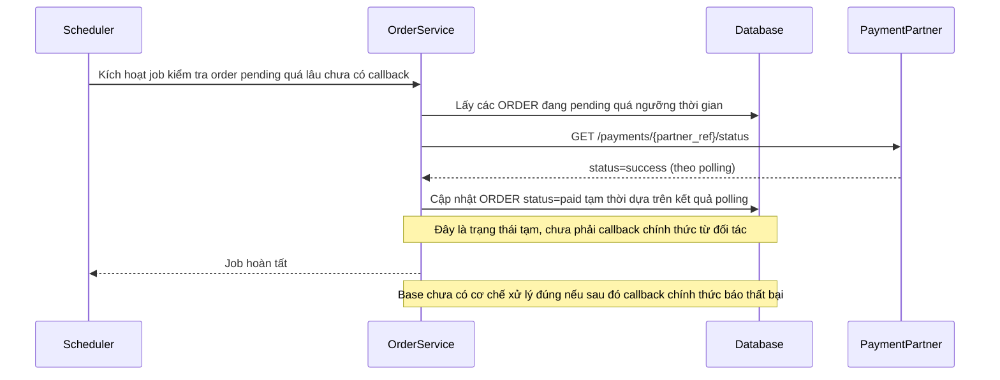

# Base sequence — Fallback status polling

Đây là **base**, flow "Polling dự phòng khi callback chưa tới" — đề bài nhắc tới flow này như bối cảnh có sẵn ("do quá lâu chưa nhận được callback nên có luồng dự phòng tự chuyển trạng thái theo polling"). Chọn dựng flow này vì hệ quả của nó (order bị chuyển tạm sang "đã thanh toán" trước khi có callback chính thức) chính là tình huống enhance phải xử lý đảo ngược đúng cách khi callback thật đến sau đó báo thất bại.

