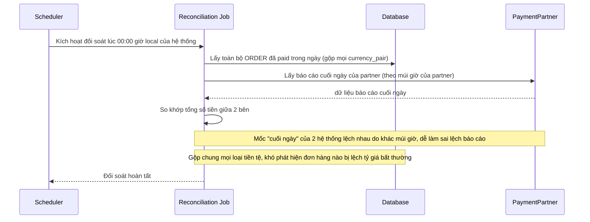

# Base sequence — Daily reconciliation

Đây là **base**, flow "Đối soát cuối ngày với đối tác thanh toán" — chọn flow này vì đây chính là flow bị ảnh hưởng trực tiếp bởi 2 vấn đề enhance nêu: mốc "cuối ngày" ở base tính theo giờ local của hệ thống (không chuẩn hóa múi giờ với đối tác), và dữ liệu bị gộp chung mọi loại tiền tệ thay vì tách riêng.

