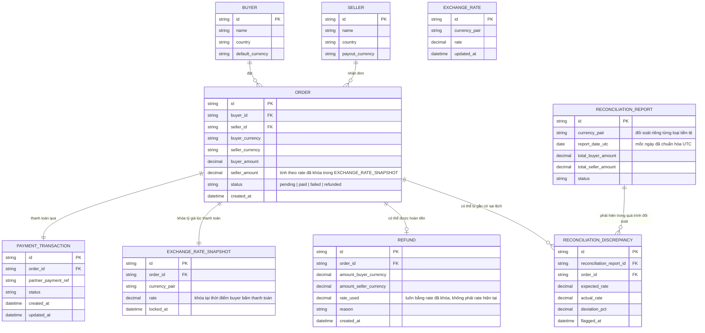

# Enhance ERD — Khóa tỷ giá theo order, refund đúng rate, đối soát theo currency chuẩn UTC

Đây là ERD **sau khi** enhance được áp dụng lên base. `BUYER`, `SELLER`, `ORDER`, `PAYMENT_TRANSACTION`, `EXCHANGE_RATE` giữ nguyên. So với base, có 3 nhóm entity mới, ứng trực tiếp với các yêu cầu trong đề bài:

- `EXCHANGE_RATE_SNAPSHOT` (mới) — khóa và lưu đúng tỷ giá tại thời điểm buyer bấm thanh toán, gắn liền với order đó. Callback dù đến trễ bao lâu cũng đọc lại từ đây thay vì tra tỷ giá hiện tại.
- `REFUND` (mới) — ghi nhận hoàn tiền khi callback thật báo thất bại sau khi order đã tạm chuyển "đã thanh toán" qua polling, số tiền hoàn luôn tính theo `EXCHANGE_RATE_SNAPSHOT` đã khóa, không phải tỷ giá hiện tại lúc hoàn tiền.
- `RECONCILIATION_REPORT` + `RECONCILIATION_DISCREPANCY` (mới) — đối soát tách riêng theo từng `currency_pair`, mốc ngày chuẩn hóa về UTC (`report_date_utc`), phát hiện và gắn cờ các order có sai lệch tỷ giá bất thường để điều tra riêng.

