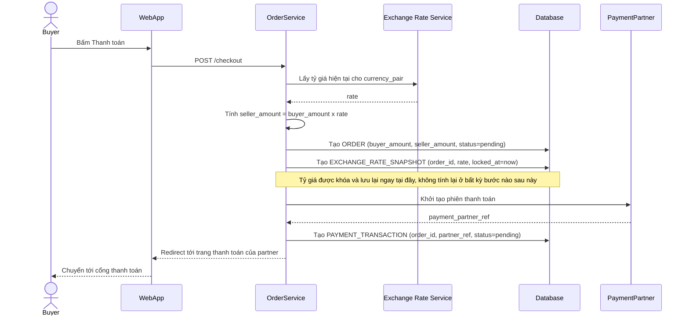

# Enhance sequence — Checkout payment

Đây là **enhance**, flow "Buyer bấm thanh toán". So với base, ngay tại thời điểm này hệ thống không chỉ tính `seller_amount` rồi bỏ qua tỷ giá đã dùng, mà còn lưu lại `EXCHANGE_RATE_SNAPSHOT` gắn với order — khóa đúng tỷ giá tại thời điểm giao dịch để mọi xử lý callback sau này (dù trễ bao lâu) đều dùng lại đúng con số này.

