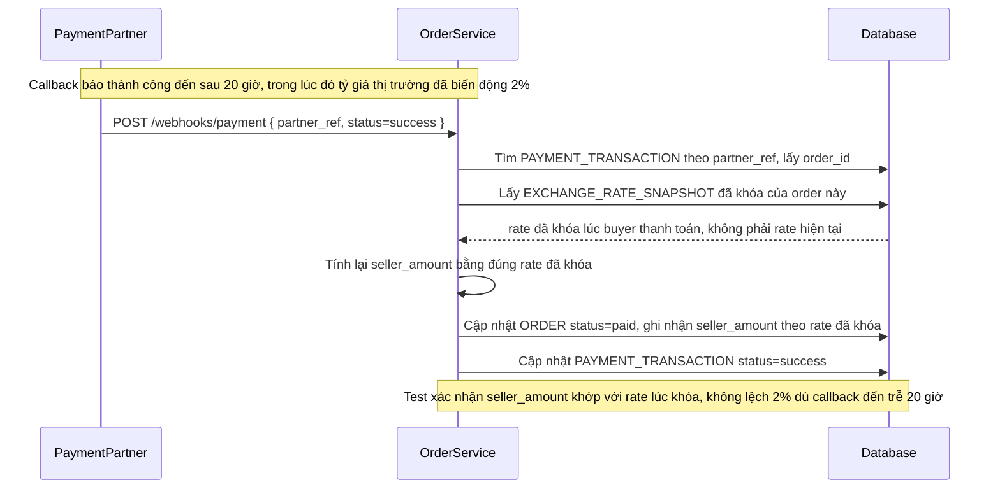

# Enhance sequence — Payment callback

Đây là **enhance**, flow "Nhận callback kết quả thanh toán từ đối tác". So với base, khi callback đến (dù trễ 20 giờ hay hơn), hệ thống không tra tỷ giá hiện tại nữa mà đọc lại `EXCHANGE_RATE_SNAPSHOT` đã khóa lúc buyer thanh toán để tính `seller_amount` cuối cùng — loại bỏ hoàn toàn rủi ro lệch số tiền do tỷ giá biến động trong lúc chờ.

