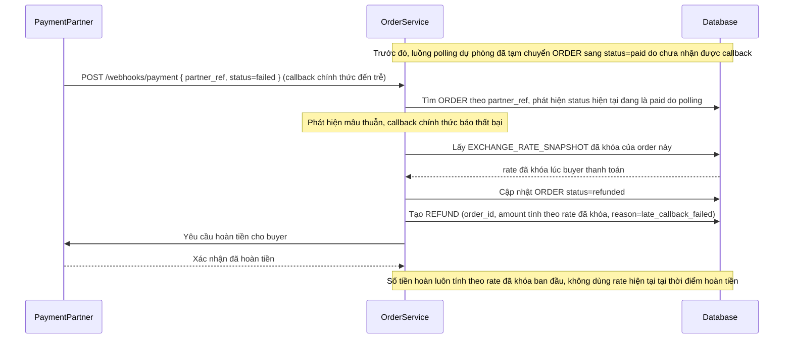

# Enhance sequence — Refund reversal

Đây là **enhance**, flow hoàn toàn mới so với base — xử lý đúng trường hợp callback chính thức báo thất bại sau khi order đã bị polling dự phòng (xem `4-base-fallback-status-polling-sqd.md`) chuyển tạm sang "đã thanh toán". Hệ thống phải hủy đơn và hoàn tiền theo đúng tỷ giá đã khóa ban đầu, không phải tỷ giá hiện tại lúc hoàn tiền.

