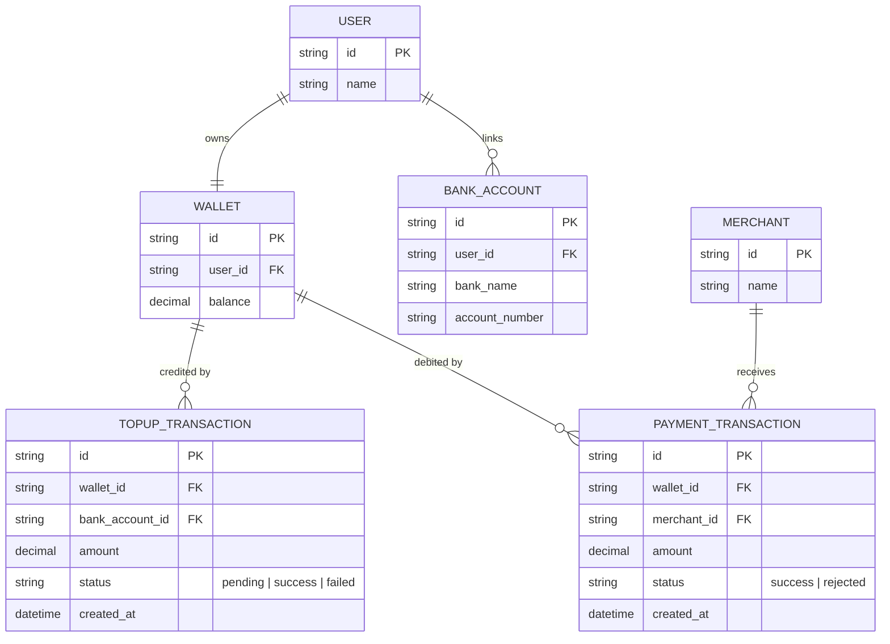

# Base ERD — Ví điện tử trước khi có atomic update chống race trên số dư

Đây là **base**: mô hình dữ liệu suy luận từ ngữ cảnh đề bài, thể hiện trạng thái hệ thống **trước khi** áp cơ chế update nguyên tử có điều kiện. Đề bài nói tới ví liên kết ngân hàng để nạp tiền và dùng số dư để thanh toán tại nhiều merchant — nên base cần đủ: user, ví với 1 trường số dư đơn giản, tài khoản ngân hàng liên kết, lịch sử nạp và lịch sử thanh toán. Base **chưa có** idempotency key cho callback nạp tiền, chưa có ledger để đối chiếu, chưa có cơ chế khóa tài khoản khi lệch số dư — những thứ đó là phần enhance.

