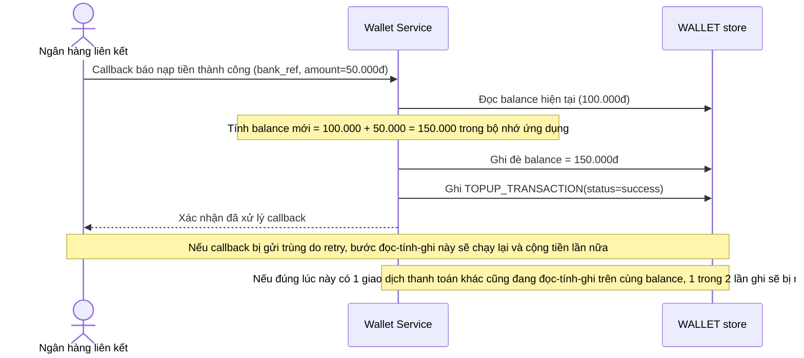

# Base sequence — Nạp tiền vào ví (đọc-tính-ghi không atomic)

Đây là **base**, flow "Nạp tiền từ ngân hàng liên kết" ở trạng thái hiện tại — service đọc số dư hiện tại, cộng thêm tiền nạp trong bộ nhớ rồi ghi đè lại, không kiểm tra idempotency theo mã giao dịch ngân hàng. Flow này liên quan mật thiết tới enhance vì đây chính là luồng tạo ra khoảng hở race khi callback nạp tiền chạm cùng lúc với giao dịch trừ tiền khác.

