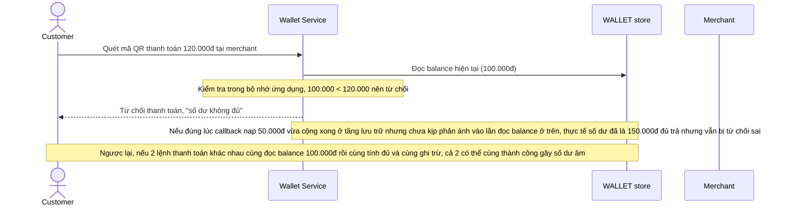

# Base sequence — Thanh toán bằng số dư ví (đọc-tính-ghi không atomic)

Đây là **base**, flow "Thanh toán tại merchant" ở trạng thái hiện tại — service đọc số dư, kiểm tra đủ hay không trong bộ nhớ ứng dụng, rồi mới trừ tiền và ghi lại, không dựa trên update nguyên tử tại tầng lưu trữ. Flow này liên quan mật thiết tới enhance vì đây chính là luồng có thể duyệt nhầm thanh toán sai hoặc gây số dư âm khi 2 giao dịch chạm cùng 1 số dư gần như đồng thời.

