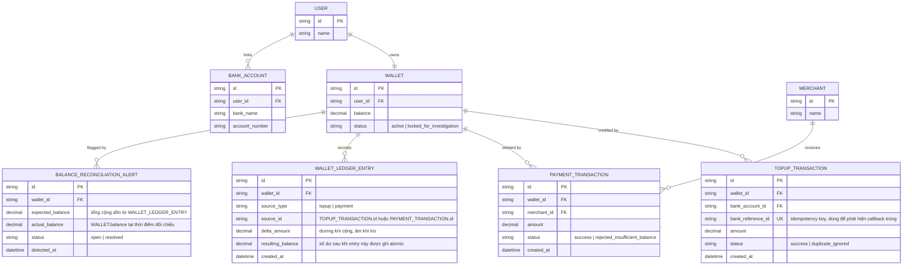

# Enhance ERD — Thêm idempotency, ledger đối chiếu và cảnh báo lệch số dư

Đây là **enhance**, mô hình dữ liệu sau khi áp cơ chế update nguyên tử có điều kiện lên base. So với base, `TOPUP_TRANSACTION` thêm `bank_reference_id` unique để idempotent theo mã giao dịch ngân hàng khi callback đến trùng, `WALLET` thêm `status` để có thể tạm khóa khi phát hiện lệch số dư. Thêm mới `WALLET_LEDGER_ENTRY` — ghi bất biến mọi lần cộng/trừ số dư, làm nguồn để job đối chiếu định kỳ tính tổng và so sánh với `WALLET.balance`; và `BALANCE_RECONCILIATION_ALERT` — ghi nhận lần lệch số dư phát hiện được, kèm trạng thái điều tra.

