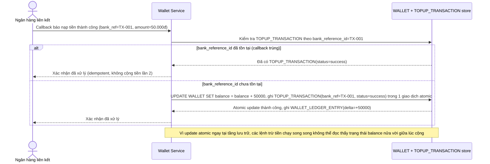

# Enhance sequence — Nạp tiền atomic + idempotent theo mã giao dịch ngân hàng

Đây là **enhance**, flow "Nạp tiền từ ngân hàng liên kết" sau khi áp update nguyên tử có điều kiện. So với base, flow này thay đổi ở 2 điểm: (1) kiểm tra `bank_reference_id` đã tồn tại trong `TOPUP_TRANSACTION` chưa trước khi cộng tiền, để callback trùng do retry không cộng 2 lần, (2) việc cộng số dư dùng update nguyên tử `balance = balance + amount` ngay tại tầng lưu trữ, không có khoảng hở giữa lúc callback bắt đầu xử lý và lúc số dư thực sự được cộng, nên các giao dịch trừ tiền chạy song song luôn thấy đúng 1 trong 2 trạng thái trước/sau, không thấy trạng thái lỡ dở.

