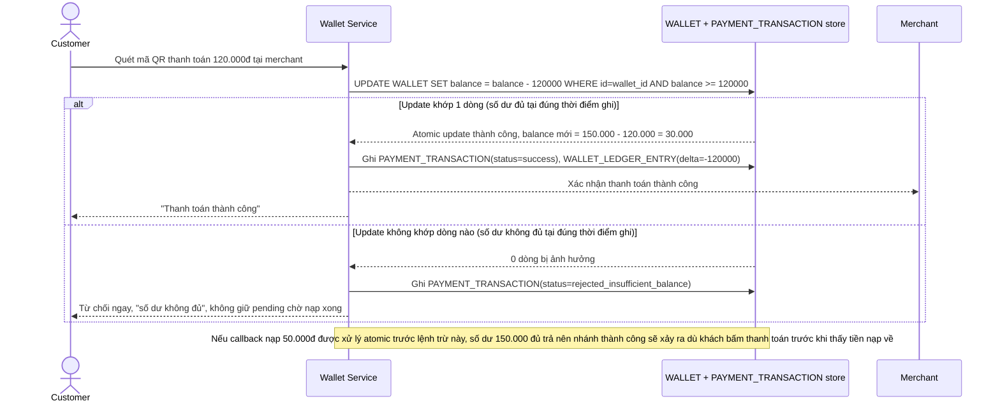

# Enhance sequence — Thanh toán bằng update nguyên tử có điều kiện

Đây là **enhance**, flow "Thanh toán tại merchant" sau khi áp update nguyên tử có điều kiện. So với base, flow này không còn đọc balance rồi tính đủ/thiếu trong bộ nhớ ứng dụng nữa — việc trừ tiền và kiểm tra đủ số dư gộp làm 1 câu update nguyên tử duy nhất tại tầng lưu trữ (`balance = balance - amount WHERE balance >= amount`), nên callback nạp tiền chạm đúng lúc thanh toán vẫn cho kết quả đúng theo thứ tự thực sự xử lý tại tầng lưu trữ, không theo thời điểm khách bấm nút. Nếu tại đúng thời điểm ghi số dư không đủ, hệ thống từ chối ngay, không giữ pending chờ nạp xong rồi âm thầm thử lại.

