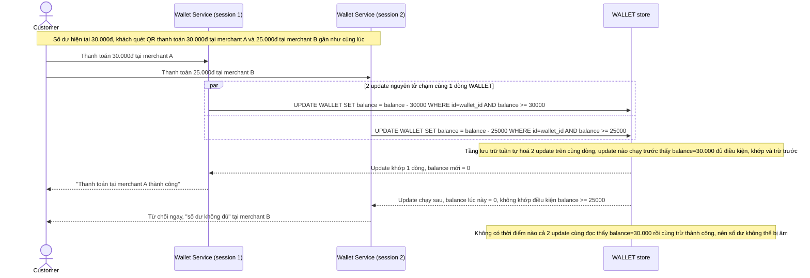

# Enhance sequence — 2 lệnh thanh toán đồng thời chỉ 1 lệnh thành công

Đây là **enhance**, flow mới phát sinh từ enhance — khách quét mã QR thanh toán ở 2 merchant gần như đồng thời từ 2 thiết bị/session trong khi số dư chỉ đủ cho 1 trong 2 lệnh. Flow này minh hoạ trực tiếp tác dụng của update nguyên tử có điều kiện ở file `6-enhance-payment-sqd.md`: 2 update chạm cùng 1 dòng `WALLET` được tầng lưu trữ tuần tự hoá, chỉ update nào còn thấy đủ số dư mới khớp điều kiện và thành công.

