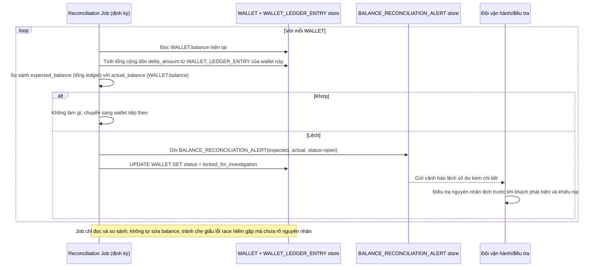

# Enhance sequence — Job định kỳ đối chiếu số dư ví với lịch sử giao dịch

Đây là **enhance**, flow hoàn toàn mới phát sinh từ enhance — job định kỳ so sánh `WALLET.balance` với tổng cộng dồn từ `WALLET_LEDGER_ENTRY` (nạp, trừ, hoàn) của từng khách, nhằm bắt các trường hợp lệch hiếm gặp lọt qua cơ chế atomic (vd lỗi hạ tầng, bug nghiệp vụ khác), cảnh báo và tạm khóa giao dịch của tài khoản bị lệch trước khi khách phát hiện và khiếu nại.

