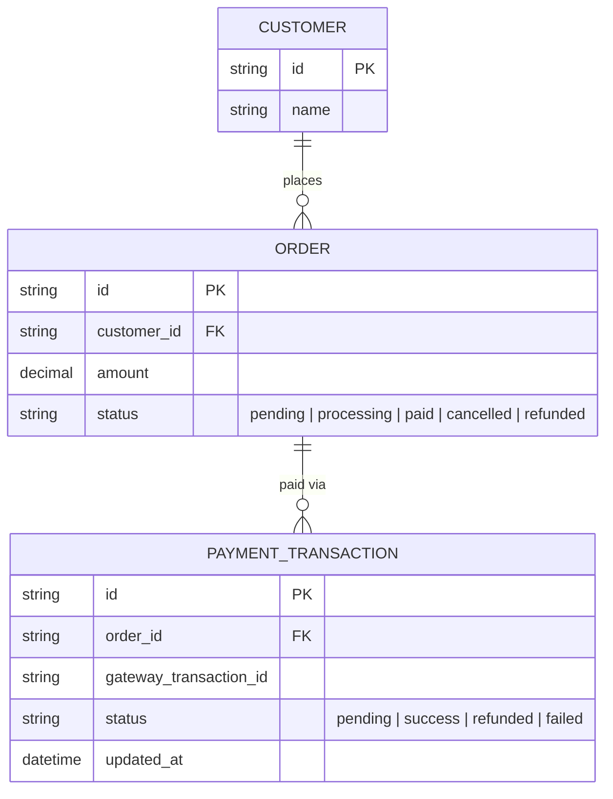

# Base ERD — E-commerce tích hợp cổng thanh toán, xử lý webhook đơn giản

Đây là **base**: mô hình dữ liệu suy luận từ ngữ cảnh đề bài, thể hiện trạng thái hệ thống **trước khi** có xử lý webhook idempotent/theo đúng thứ tự thật. Đề bài nói tới sàn e-commerce nhận callback từ cổng thanh toán bên thứ ba báo kết quả giao dịch — nên base cần đủ: khách hàng, đơn hàng, và giao dịch thanh toán gắn với đơn hàng. Base **chưa có** cơ chế lưu vết từng webhook nhận được để chống trùng/xác định thứ tự, chưa có job đối soát, chưa có polling dự phòng — những thứ đó là phần enhance.

