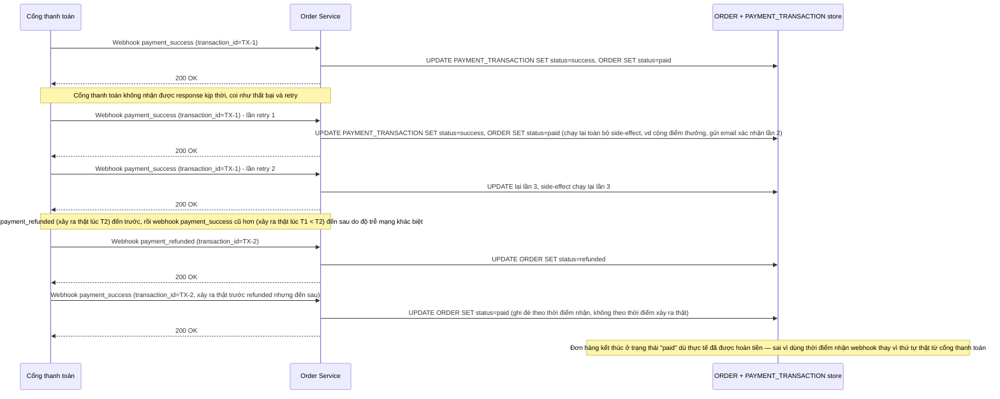

# Base sequence — Xử lý webhook đơn giản (không idempotent, không xét thứ tự thật)

Đây là **base**, flow "Nhận webhook từ cổng thanh toán" ở trạng thái hiện tại — app cập nhật thẳng `ORDER.status`/`PAYMENT_TRANSACTION.status` theo nội dung webhook vừa nhận, không kiểm tra đã xử lý `transaction_id` này chưa, không xét thứ tự thật của sự kiện phía cổng thanh toán mà chỉ dựa vào thứ tự app nhận được. Flow này liên quan mật thiết tới enhance vì toàn bộ 2 yêu cầu đầu (idempotent theo transaction_id, xác định đúng thứ tự thật) đều nhằm sửa lỗ hổng ở đây.

