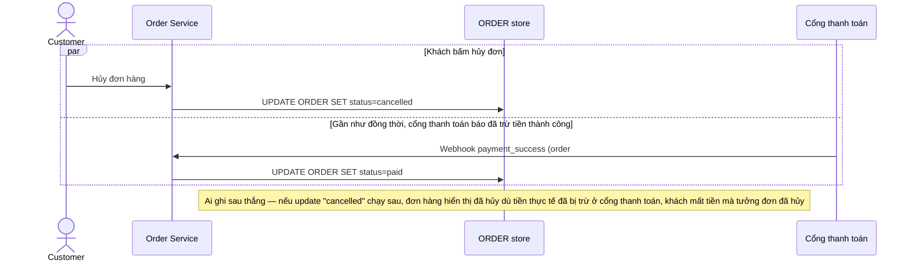

# Base sequence — Hủy đơn hàng (last-write-wins, không xét nguồn sự thật)

Đây là **base**, flow "Khách bấm Hủy đơn" ở trạng thái hiện tại — app cập nhật thẳng `ORDER.status = cancelled` theo request của khách, không kiểm tra webhook thanh toán có đang/đã xử lý song song hay không. Flow này liên quan mật thiết tới enhance vì yêu cầu thứ 3 của đề bài quy định rõ ai thắng khi request hủy đơn chạm webhook success gần như đồng thời — mà base hiện chưa có quy tắc nào cả, ai ghi sau thắng.

