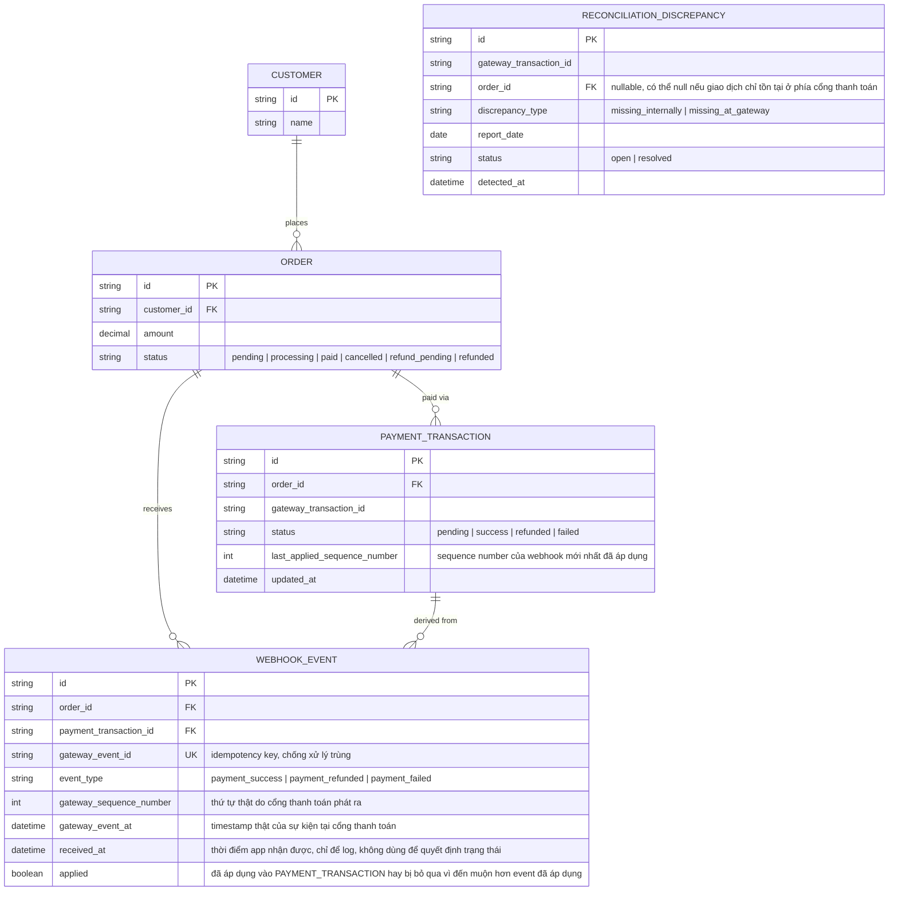

# Enhance ERD — Thêm log webhook idempotent theo thứ tự thật và đối soát hàng ngày

Đây là **enhance**, mô hình dữ liệu sau khi áp cơ chế xử lý webhook idempotent + đúng thứ tự thật lên base. So với base, thêm mới `WEBHOOK_EVENT` — lưu lại từng webhook nhận được kèm `gateway_event_id` unique (chống xử lý trùng) và `gateway_sequence_number`/`gateway_event_at` (thứ tự thật từ phía cổng thanh toán, dùng để quyết định trạng thái cuối thay vì thời điểm app nhận). `PAYMENT_TRANSACTION` thêm `last_applied_sequence_number` để biết event nào đã áp dụng gần nhất, tránh bị 1 event cũ hơn đến muộn ghi đè ngược. `ORDER` thêm trạng thái `refund_pending` cho luồng hoàn tiền khi hủy đơn đụng webhook success. Thêm mới `RECONCILIATION_DISCREPANCY` cho job đối soát hàng ngày.

