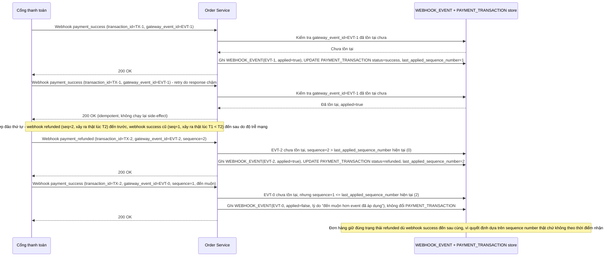

# Enhance sequence — Webhook idempotent + xác định thứ tự theo sequence number thật

Đây là **enhance**, flow "Nhận webhook từ cổng thanh toán" sau khi áp idempotency + ordering theo nguồn sự thật. So với base, flow này thay đổi ở 2 điểm: (1) kiểm tra `gateway_event_id` đã tồn tại trong `WEBHOOK_EVENT` chưa trước khi áp dụng thay đổi, webhook trùng chỉ trả 200 OK mà không làm gì thêm, (2) chỉ áp dụng thay đổi nếu `gateway_sequence_number` của webhook mới lớn hơn `last_applied_sequence_number` hiện tại — quyết định theo thứ tự thật phía cổng thanh toán, không theo thời điểm app nhận.

