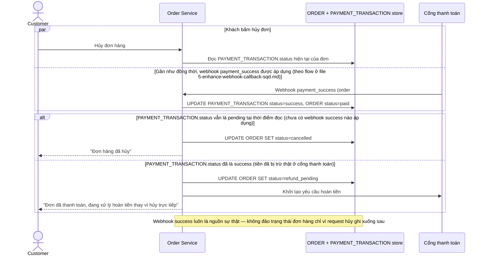

# Enhance sequence — Hủy đơn: webhook success là nguồn sự thật, chuyển sang hoàn tiền

Đây là **enhance**, flow "Khách bấm Hủy đơn" sau khi có quy tắc phân định rõ ai thắng khi đụng webhook thanh toán. So với base (last-write-wins), flow này thay đổi ở chỗ: trước khi hủy, app kiểm tra `PAYMENT_TRANSACTION.status` — nếu webhook success đã áp dụng (tiền đã thực sự bị trừ ở cổng thanh toán, nguồn sự thật), đơn hàng **không được hủy trực tiếp** mà chuyển sang `refund_pending` và khởi tạo luồng hoàn tiền, thay vì đảo trạng thái đơn giản theo request đến sau.

