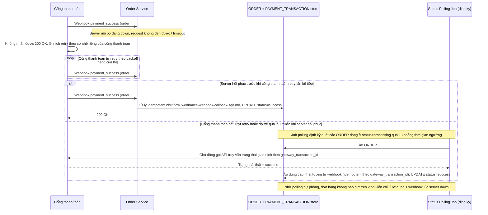

# Enhance sequence — Server down khi nhận webhook, retry của cổng + polling dự phòng

Đây là **enhance**, flow hoàn toàn mới phát sinh từ enhance — xử lý tình huống server nội bộ down đúng lúc cổng thanh toán gửi webhook, đảm bảo đơn hàng không bị "treo" vĩnh viễn ở trạng thái `processing` chỉ vì lỡ mất đúng 1 webhook. Dựa vào 2 lớp phòng vệ: cơ chế retry sẵn có của cổng thanh toán, và job polling chủ động của app cho các đơn hàng bị kẹt lâu.

