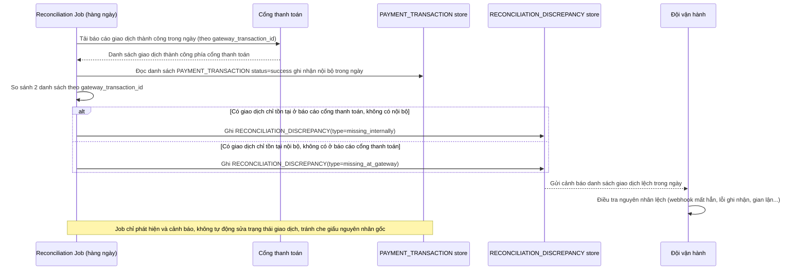

# Enhance sequence — Job đối soát hàng ngày với báo cáo cổng thanh toán

Đây là **enhance**, flow hoàn toàn mới phát sinh từ enhance — job chạy hàng ngày so sánh danh sách giao dịch thành công ghi nhận nội bộ (`PAYMENT_TRANSACTION`) với báo cáo giao dịch thành công từ cổng thanh toán, phát hiện và cảnh báo các giao dịch chỉ có ở 1 bên (lệch do webhook bị mất hoàn toàn kể cả sau khi có polling dự phòng, hoặc do lỗi khác).

