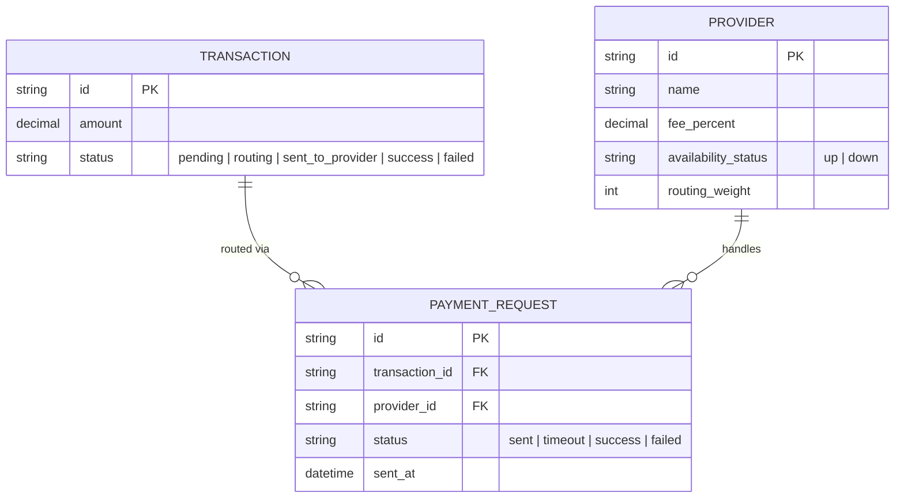

# Base ERD — Định tuyến giao dịch qua nhiều nhà cung cấp (chưa có cơ chế an toàn)

Đây là **base**: mô hình dữ liệu suy luận từ ngữ cảnh đề bài, thể hiện trạng thái hệ thống **trước khi** có các cơ chế an toàn cho failover/lock gán nhà cung cấp/chuẩn hoá callback. Đề bài mô tả hệ thống trung gian đã biết định tuyến theo tỷ lệ/phí/tình trạng sẵn sàng — nên base cần đủ: giao dịch, danh sách nhà cung cấp kèm trọng số routing, và bản ghi mỗi lần gửi yêu cầu thanh toán tới 1 nhà cung cấp. Base **chưa có** mã tham chiếu để map callback, chưa có log lịch sử routing, chưa có cơ chế khoá atomic khi gán nhà cung cấp, chưa có dashboard theo dõi tỷ lệ thành công — những thứ đó là phần enhance.

