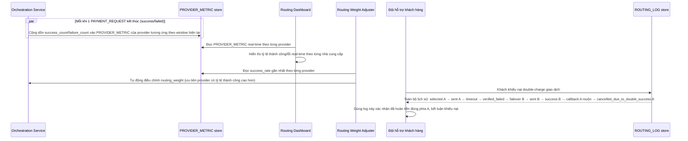

# Enhance sequence — Dashboard tỷ lệ thành công real-time và log lịch sử routing

Đây là **enhance**, flow mới phát sinh từ enhance — tổng hợp `PROVIDER_METRIC` real-time theo từng nhà cung cấp để tự động điều chỉnh `routing_weight`, và cho phép tra cứu toàn bộ `ROUTING_LOG` của 1 giao dịch (đã thử nhà cung cấp nào, theo thứ tự nào, kết quả gì) phục vụ điều tra khi có khiếu nại double-charge như tình huống ở file `9-enhance-race-failover-vs-callback-sqd.md`.

