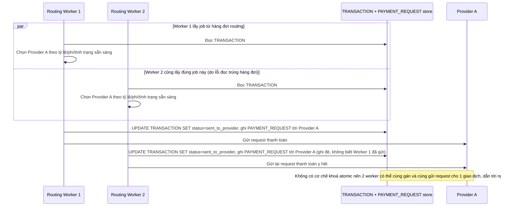

# Base sequence — Chọn nhà cung cấp và gửi giao dịch (không lock atomic)

Đây là **base**, flow "Định tuyến và gửi giao dịch tới nhà cung cấp" ở trạng thái hiện tại — worker đọc trạng thái giao dịch, chọn nhà cung cấp theo tỷ lệ/phí/tình trạng sẵn sàng, rồi cập nhật trạng thái và gửi request, nhưng không dùng update nguyên tử có điều kiện khi chuyển trạng thái. Flow này liên quan mật thiết tới enhance vì yêu cầu thứ 2 của đề bài (mỗi giao dịch chỉ được gán đúng 1 nhà cung cấp) nhằm sửa đúng lỗ hổng race giữa 2 worker ở đây.

