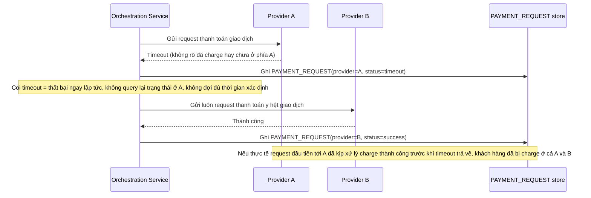

# Base sequence — Timeout ở nhà cung cấp A, failover ngay sang B (không xác minh)

Đây là **base**, flow "Timeout khi gửi thanh toán, chuyển sang nhà cung cấp khác" ở trạng thái hiện tại — khi request tới Provider A timeout, hệ thống coi ngay là thất bại và gửi request y hệt sang Provider B mà không xác minh lại trạng thái thật ở A. Flow này liên quan mật thiết tới enhance vì yêu cầu đầu tiên của đề bài nhằm sửa đúng nguy cơ double-charge do failover mù quáng này.

