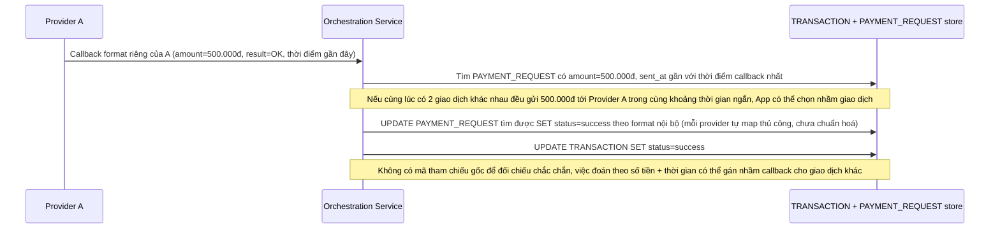

# Base sequence — Nhận callback, map lại giao dịch theo số tiền + thời gian

Đây là **base**, flow "Nhận callback từ nhà cung cấp" ở trạng thái hiện tại — mỗi nhà cung cấp trả callback theo format riêng, hệ thống cố map ngược lại giao dịch gốc bằng cách so khớp số tiền và khoảng thời gian gần nhất, không dựa trên mã tham chiếu đã gửi kèm lúc khởi tạo. Flow này liên quan mật thiết tới enhance vì yêu cầu thứ 3 của đề bài nhằm sửa đúng nguy cơ map nhầm giao dịch khi trùng giá trị.

